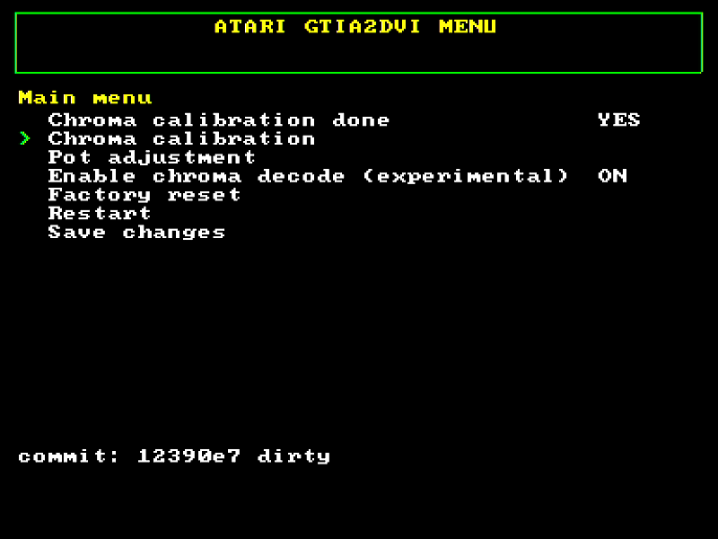
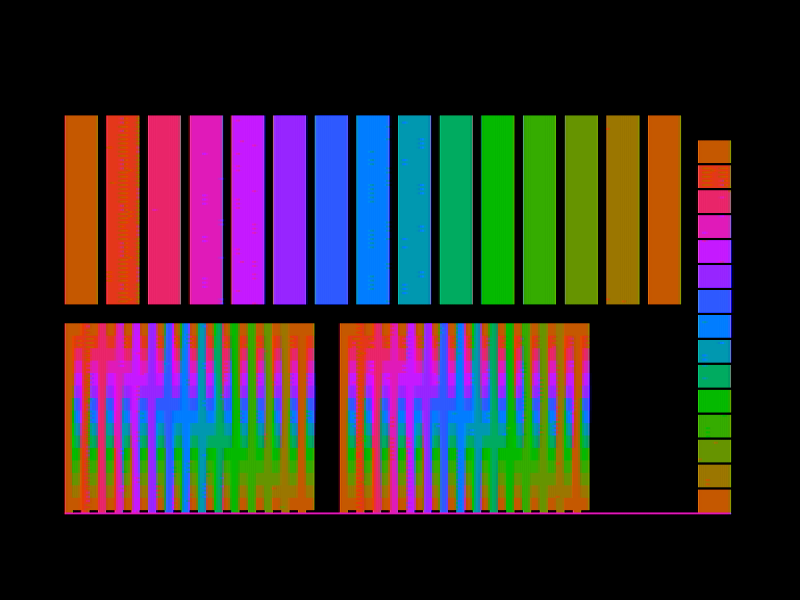
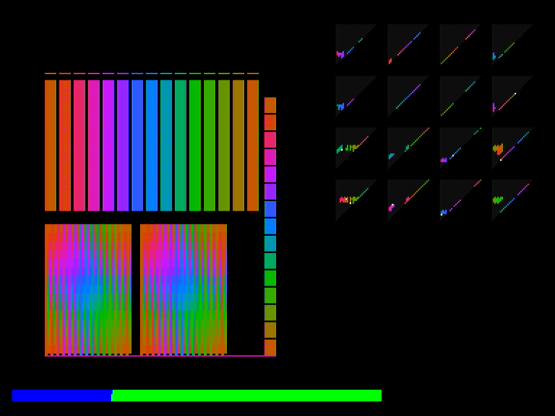
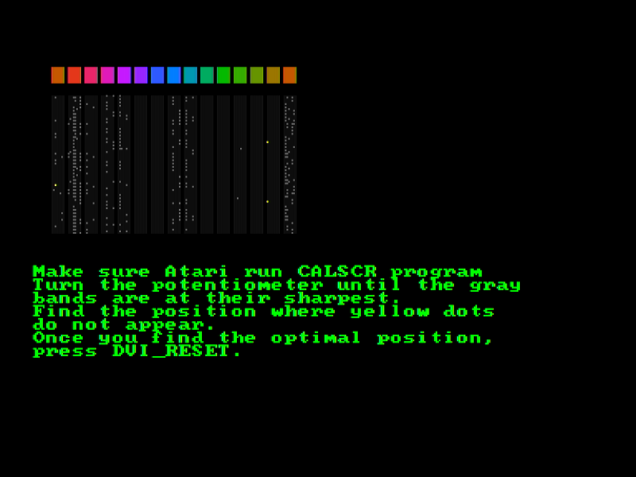

# GTIA2DVI

**GTIA2DVI** jest prototypem urządzenia umożliwiającego wyświetlanie obrazu cyfrowego w standardzie DVI przez
ośmiobitowe komputery Atari. Komputery te były produkowane w czasach gdy telewizja cyfrowa nie była publicznie dostępna 
przez co są zdolne generowac obraz jedynie w analogowych systemach PAL / NTSC. Większośc nowych telewizorów nie jest 
w stanie wyświetlić obrazu generowaniego przez Atari w zadowalającej jakosci.
Powstało wiele urządzeń oraz modów toru video Atari w mniejszym lub większym stopniu poprawiajacych jakość obrazu.
Jednak wszystkie te rozwiązania polegaja na zmianie parametrów obrazu analogowego a następnie jego digitalizację i 
konwersję do obrazu cyfrowego.

Ten projekt jest próbą rozwiązania problemu w pełni w domenie cyfrowej. Sercem projektu jest mikrokontroler RP2040 i biblioteka [PicoDVI](https://github.com/Wren6991/PicoDVI) dzięki której może on generować obraz DVI. GTIA2DVI w sposób software'owy ale z wykorzystaniem udostępnianego przez
RP2040 hardweru tj: DMA, PIO, Interpolator realizuje dekodowanie sygnałów generowanych przez Atari oraz tworzenie obrazu.

## Szczegóły techniczne

Obraz w komputerach Atari jest generowany przez układy specializowane ANTIC / GTIA. 
Ten drugi układ jest odpowiedzialny z generowanie sygnałów które są następnie przetwarzane przez układy analogowe
w obraz w systemie PAL/NTSC. Z dostępnych w internecie materiałów można wywnioskować że wszystkie sygnały wyjściowe GTIA
składające się na obraz wideo na pinach tego układu są cyfrowe. Są to następujące:

| nazwa sygnału | pin GTIA    | opis                                                                          |
|---------------|-------------|-------------------------------------------------------------------------------|
| OSC           | 28          | sygnał zegarowy synchronizujący pixele w trybie hires                         |
| CSYNC         | 25          | sygnał synchronizacji pionowej i poziomej                                     |
| LUM0 - LUM3   | 31,22,23,24 | 4-bitowy równoległa linia prezentująca wartość jasności pixela                |
| PAL           | 16          | sygnał zegara odpowiadającego za kodowanie koloru w systemie PAL              |
| COLOR         | 21          | wartość koloru okreeślona przez przesunięcie fazowe tego sygnału względem PAL |

Celem projektu jest generowanie obrazu cyfrowego na podstawie wyżej wymienionych sygnałów.

## Budowanie projektu

Należy mieć skonfigurowane środowisko SDK dla RP2040 (patrz https://datasheets.raspberrypi.com/pico/getting-started-with-pico.pdf)

Projekt mozna zbudwać posługując się IDE (np. Visual Studio Code)

lub z linii komend:

```shell

cd software
mkdir build
cd build
cmake -DCMAKE_BUILD_TYPE=Release ..
make

```

Wynikiem procesu budowania jest plik: `build/gtia2dvi/gtia2dvi.uf2` który nalezy wgrać do RP2040.

Uwaga! Jedynie plik zbudowane w `BUILD_TYPE=Release` zapewniają poprawne działanie programu

## Uruchomienie

Po zamontowaniu urządzenia w Atari sygnał DVI będzie dostępny automatycznie. W podstawowej konfiguracji generowany jest 
sygnał monochroamtyczny w odcieniach szarości. 
Dekodowanie sygnału **chroma** jest w fazie eksperymentalnej i może zostać włączone z poziomu menu po uprzednim skalibrowaniu.

Urządzenie posiada 3 przyciski:

* **RESET** służący do resetowania
* **BTN_A** słuzący do aktywacji menu podczas restartu oraz do wybierania opcji menu. Poza menu przełącza tryb wyświetlania mono / color
* **BTN_B** służacy do aktywacji wybranej opcj menu. Poza menu pełni funkcję stopklatki (zatrzymuje odświerzanie obrazu Atari)

Aby wejść do menu systemowego należy trzymac wciśnięty przycisk **BTN_A** w trakcie restartu urządzenia (za pomocą przycisku reset)

## Opcje menu



* Informacja o statusie kalibracji
* [Kalibracja sygnału chroma](#kalibracja-sygnału-chroma)
* [Procedura ustawiania potencjometru CADJ](#ustawienie-potencjometru-CADJ)
* Włączanie / wyłączanie dekodowania
* Przywrócenie do ustawień fabrycznych
* Wyjście z menu i powrót do normalnego trybu
* Zapisanie wprowadzonych zmian

## Kalibracja sygnału chroma

Należy uruchomić Atari Basic i załadować program CALSCR którego listing znajduje się w folderze `atari`
Program wyświetla obraz służący do kalibracji. 



Gdy jego tworzenie zostanie zakończone należy przejść do menu GTIA2DVI.
Następnie wybrać opcję `Chroma Calibration` i ją potwierdzić.

W czasie kalibracji prezentowany jest na żywo aktualny postęp budowania mapy kolorów.
Proces składa się zdwóch przebiegów i trwa ok. 95 sekund. Po tym czasie urządzenie zapisze zarejestrowane mapy kolorów 
w automatycznie pamięci FLASH i automatycznie się zrestartuje.



## Ustawienie potencjometru CADJ

W pewnych przypadkach aby uzyskać dobry rezultat kalibracji niezbędne jest dostrojenie potencjometru CADJ.
W trakcie tego procesu Atari powinno wyświetlać ten sam obraz jak w procesie kalibracji (CALSCR).
Należy znaleźć takie położenie w którym na obrazie nie występują żółte kropki oraz ilość szarych jest jak najmniejsza.
Po zakończeniu regulacji należy przycisnąć RESET na płytce GTIA2DVI




## Dodatkowe wskazówki

Najlepszą jakość wyświetlanego koloru można osiągnąc na płytach które zapewniają niski poziom szumów i zakłóceń sygnałów.
Dodatkowe rozszerzenia np. U1MB, SIDE2 generują zauważalne zakłócenia w wyświetlanym kolorze
Pozytywny wpływ na generowany obraz mogą mieć:
* Zamiana dławika L37 na rezystor 470ohm
* Wymiana kondensatora C50 na nowy o niskim ESR
* Wymina potencjometru CADJ (R38) na precyzyjny wieloobrotowy
* zastosowanie Static RAM (niezweryfikowane)


## Troubleshooting

1) **Obraz DVI nie jest wyświetlany** należy:
   * wyłączyć Atari i zdemontowac GTIA2DVI
   * zweryfikować wszystkie połączenia
   * wgrać jeden z przykładowych programów z repozytorium PicoDVI (https://github.com/Wren6991/PicoDVI)


    
